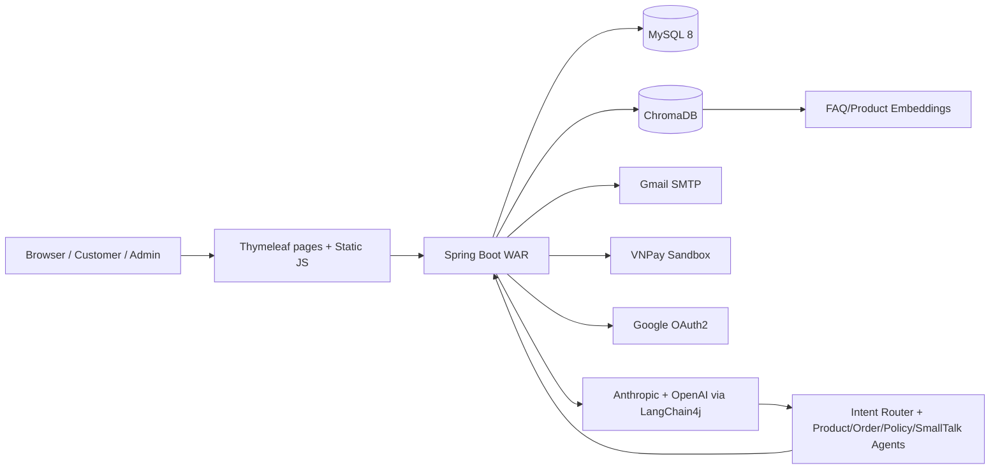

# 👟 5A Store — AI-Powered E-Commerce Platform

<p align="center">
  
  
  
  
  
  
  
</p>

<p align="center">
  Một sàn thương mại điện tử bán giày <b>full-stack</b> xây bằng Spring Boot, không dừng ở CRUD:<br/>
  có <b>chatbot AI đa agent</b>, <b>RAG tìm kiếm ngữ nghĩa</b>, thanh toán VNPay, JWT + OAuth2, và hạ tầng deploy bằng Docker.
</p>

<p align="center">
  <a href="https://drive.google.com/file/d/18cRu3Oq981LGP84frsLjJMgjys66yIEt/view?usp=drive_link"><b>▶ Xem video demo</b></a>
  ·
  <a href="#-điểm-nổi-bật-kỹ-thuật">Điểm nổi bật</a>
  ·
  <a href="#-tech-stack">Tech stack</a>
  ·
  <a href="#-chạy-dự-án">Chạy dự án</a>
</p>

---

## 🎯 Tóm tắt cho nhà tuyển dụng

**5A Store** là project cá nhân mô phỏng một hệ thống e-commerce sản xuất thực (production-like), được xây dựng để chứng minh năng lực **backend/full-stack Java** qua các bài toán thật:

| Bài toán | Cách giải quyết trong project |
| --- | --- |
| Thiết kế domain e-commerce phức tạp | Sản phẩm có biến thể size/màu/tồn kho, giỏ hàng, checkout nhiều bước, voucher theo phạm vi, đổi trả |
| Bảo mật hệ thống | JWT stateless qua cookie, refresh token, BCrypt, Google OAuth2, phân quyền theo role |
| Tích hợp bên thứ ba | Cổng thanh toán VNPay (sandbox), Gmail SMTP, WebSocket/STOMP realtime |
| Ứng dụng AI vào sản phẩm thật | Chatbot **multi-agent** (LangChain4j) + **RAG** trên ChromaDB để tư vấn sản phẩm/chính sách/đơn hàng |
| Tư duy vận hành & triển khai | Docker Compose (MySQL + ChromaDB + App), Maven WAR, seed data, cấu hình deploy Railway |

➡️ Nếu bạn muốn đánh giá năng lực xử lý một hệ thống có **nhiều domain kết hợp AI thực chiến** (không phải chatbot demo tách rời), đây là project phù hợp để xem code.

## 🎬 Demo

📹 Video demo đầy đủ luồng khách hàng + admin + chatbot AI: [Xem trên Google Drive](https://drive.google.com/file/d/18cRu3Oq981LGP84frsLjJMgjys66yIEt/view?usp=drive_link)

## ✨ Điểm nổi bật kỹ thuật

- **E-commerce end-to-end**: danh mục, thương hiệu, biến thể sản phẩm (size/màu/tồn kho), giỏ hàng, checkout nhiều bước, đơn hàng, hủy đơn, đổi trả, voucher, đánh giá sản phẩm.
- **AI shopping assistant**: chatbot dùng LangChain4j Agentic Services, Anthropic chat model, OpenAI embeddings và ChromaDB để tư vấn sản phẩm, chính sách và tra cứu đơn hàng.
- **RAG + semantic search**: ingest FAQ từ `src/main/resources/knowledge-base/faq`, lưu embedding vào ChromaDB, hỗ trợ truy vấn chính sách và tìm sản phẩm theo ngữ nghĩa thay vì chỉ khớp từ khóa.
- **Admin operations**: dashboard thống kê, quản lý sản phẩm/variant/hình ảnh, quản lý user, đơn hàng, đổi trả và voucher.
- **Authentication**: Spring Security stateless, JWT lưu bằng cookie, BCrypt password encoder, Google OAuth2.
- **Payment & notification**: VNPay sandbox, COD, email xác nhận đơn hàng, OTP quên mật khẩu, notification center, WebSocket/STOMP.
- **Deployment-ready**: Maven wrapper, WAR packaging, Dockerfile multi-stage, `docker-compose.yml` cho MySQL + ChromaDB + app, cấu hình Railway.

## 🛠 Tech stack

| Layer | Công nghệ |
| --- | --- |
| Backend | Java 17, Spring Boot 3.5.8, Spring MVC, Spring Data JPA, Spring Security, Bean Validation |
| View/UI | Thymeleaf, HTML/CSS/JavaScript |
| Database | MySQL 8, Hibernate/JPA |
| AI | LangChain4j (Agentic Services), Anthropic Chat Model, OpenAI Embedding Model, ChromaDB |
| Auth | JWT cookie auth, refresh token, BCrypt, Google OAuth2 |
| Payment | VNPay sandbox, COD, refund flow |
| Realtime | Spring WebSocket/STOMP |
| Email | Spring Mail / Gmail SMTP |
| Build & Deploy | Maven, WAR, Docker, Docker Compose, Railway |

## 🏗 Kiến trúc tổng quan



## 🧩 Chức năng chính

### Khách hàng
- Xem trang chủ, danh sách sản phẩm, chi tiết sản phẩm.
- Lọc/tìm kiếm theo danh mục, thương hiệu, tên và tìm kiếm ngữ nghĩa (semantic search).
- Thêm sản phẩm vào giỏ hàng theo size/màu, cập nhật số lượng, đổi variant, xóa mềm item.
- Checkout nhiều bước, lưu địa chỉ giao hàng, áp dụng voucher.
- Thanh toán COD hoặc tạo URL thanh toán VNPay.
- Xem lịch sử đơn hàng, hủy đơn, xác nhận đã nhận hàng, yêu cầu đổi trả.
- Đánh giá sản phẩm sau khi đơn hoàn tất, kèm upload hình ảnh review.
- Nhận thông báo đơn hàng, thanh toán, voucher.
- Trò chuyện với chatbot AI để hỏi sản phẩm, tồn kho, chính sách và thông tin đơn hàng.

### Admin
- Dashboard tổng quan và báo cáo chi tiết.
- Quản lý sản phẩm, upload ảnh, quản lý variant size/màu/tồn kho.
- Quản lý user, trạng thái hoạt động và role.
- Quản lý đơn hàng: xác nhận, giao hàng, hủy, xử lý đổi trả.
- Quản lý voucher: tạo voucher theo phạm vi (toàn shop/danh mục/thương hiệu/sản phẩm), bật/tắt, xóa voucher hết hạn.

### AI / RAG
- `IntentRouter` — phân loại ý định người dùng.
- `ProductExpertAgent` — dùng tool tìm kiếm sản phẩm và tồn kho.
- `OrderExpertAgent` — dùng tool truy vấn đơn hàng.
- `PolicyExpertAgent` — dùng retriever từ FAQ embedding (RAG).
- `SmallTalkAgent` — xử lý hội thoại thông thường.
- Log agent, tool call và response theo session tại `logs/agent`.
- API giám sát agent tại `/api/agent-monitor`.

## 📂 Cấu trúc thư mục

```text
online_shoe_store/
├── src/main/java/com/example/online_shoe_store/
│   ├── Config/                 # Security, WebSocket, payment, MVC static resources
│   ├── Controller/             # MVC pages, REST API, admin, checkout, payment
│   ├── Entity/                 # JPA entities và enums
│   ├── Repository/             # Spring Data repositories
│   ├── Security/               # JWT, refresh token, OAuth2 handlers
│   ├── Service/                # Business logic
│   │   └── ai/                 # Agent, RAG, tools, model/vector config, monitoring
│   ├── dto/                    # Request/response/projection DTOs
│   ├── mapper/                 # MapStruct mappers
│   └── exception/               # Business/payment/order exceptions
├── src/main/resources/
│   ├── templates/               # Thymeleaf pages/fragments/email templates
│   ├── static/                  # CSS, JS, images, videos
│   ├── knowledge-base/faq/      # Markdown FAQ dùng cho RAG
│   └── application.properties   # Local Spring config
├── src/data/
│   ├── images/                  # Product/category seed images
│   └── script_sql/              # MySQL dump seed data
├── data/images/                 # Runtime uploads
├── Dockerfile
├── docker-compose.yml
├── railway.toml
└── pom.xml
```

## 🔌 API & route tiêu biểu

| Nhóm | Route |
| --- | --- |
| Pages | `/`, `/home`, `/products`, `/product-detail/{id}`, `/profile`, `/orders`, `/checkout/step1` |
| Auth | `/login`, `/register`, `/forgot-password`, `/oauth2/authorization/google` |
| Product | `/api/products`, `/api/products/{id}`, `/api/search/semantic`, `/api/categories`, `/api/brands` |
| Cart/Checkout | `/api/cart`, `/api/cart/add`, `/api/checkout/data`, `/api/checkout/place-order` |
| Orders | `/api/orders/my-orders`, `/api/orders/{orderId}`, `/api/admin/orders` |
| Payment | `/api/payments/create`, `/api/payments/vnpay/callback`, `/api/payments/refund` |
| Review | `/api/reviews`, `/api/reviews/pending`, `/api/reviews/product/{productId}` |
| Voucher | `/api/vouchers`, `/api/vouchers/valid`, `/api/vouchers/apply` |
| AI Chat | `/api/chat/send`, `/api/agent-monitor/**` |
| Admin UI | `/admin/dashboard`, `/admin/users`, `/admin/products`, `/admin/orders`, `/admin/returns`, `/admin/vouchers` |

## 🚀 Chạy dự án

### Yêu cầu môi trường
- Java 17+ để chạy local bằng Maven (Maven Wrapper `mvnw`/`mvnw.cmd` có sẵn).
- Docker Desktop nếu chạy bằng Docker Compose.
- MySQL 8, ChromaDB 0.4.24.
- API key Anthropic và OpenAI nếu muốn chạy đầy đủ chatbot/embedding.

### Cấu hình môi trường
Tạo file `.env` ở root project (không commit — đã có trong `.gitignore`):

```env
MYSQL_ROOT_PASSWORD=change_me
MYSQL_DATABASE=shoe_store
MYSQL_USERNAME=root
MYSQL_PASSWORD=change_me
MYSQL_PORT=3306

APP_PORT=8080
APP_BASE_URL=http://localhost:8080
CHROMA_PORT=8001

JWT_SECRET=change_me_at_least_32_characters

OPENAI_API_KEY=sk-your-openai-key
OPENAI_EMBEDDING_MODEL=text-embedding-3-small
ANTHROPIC_API_KEY=sk-ant-your-anthropic-key
ANTHROPIC_MODEL_WORKER=claude-3-5-haiku-20241022
ANTHROPIC_MODEL_ORCHESTRATOR=claude-3-5-haiku-20241022

VNPAY_TMN_CODE=your_vnpay_tmn_code
VNPAY_HASH_SECRET=your_vnpay_hash_secret
REFUND_IP=localhost:8080

MAIL_USERNAME=your_email@gmail.com
MAIL_PASSWORD=your_gmail_app_password
SUPPORT_EMAIL=your_support_email@gmail.com

GOOGLE_CLIENT_ID=your_google_client_id.apps.googleusercontent.com
GOOGLE_CLIENT_SECRET=your_google_client_secret
```

> Nếu giữ `MYSQL_USERNAME=root`, đặt `MYSQL_PASSWORD` trùng `MYSQL_ROOT_PASSWORD`. Nếu dùng `.env.example`, đảm bảo không còn marker merge conflict (`<<<<<<<`, `=======`, `>>>>>>>`) trước khi copy sang `.env`.

### Chạy bằng Docker Compose (khuyến nghị)

```bash
docker compose up -d --build
```

- Web app: `http://localhost:8080`
- ChromaDB: `http://localhost:8001`
- MySQL: `localhost:3306`

```bash
docker compose logs -f app          # xem log app
docker compose down                 # dừng service
docker compose down -v && docker compose up -d --build   # reset toàn bộ DB/vector volume
```

Database được seed từ `src/data/script_sql/dump-shoe_store-202601012053.sql`.

### Chạy local để phát triển (hybrid)

```bash
docker compose up -d mysql chromadb
```

```powershell
# Windows
.\mvnw.cmd spring-boot:run
```
```bash
# macOS/Linux
./mvnw spring-boot:run
```

> `docker-compose.yml` mặc định map ChromaDB ra host port `8001`, trong khi `application.properties` local có thể đang dùng `chroma.base.url=http://localhost:8000`. Đồng bộ lại `chroma.base.url` hoặc `CHROMA_PORT` cho khớp.

### Build & test

```bash
./mvnw test
./mvnw clean package
```

Dockerfile build WAR bằng `mvn clean package -DskipTests -B`, chạy runtime bằng `java -jar app.war`.

## 🗃 Dữ liệu và file upload

- Product/category seed images: `src/data/images`.
- Runtime upload (product/review images): `data/images`.
- `WebConfig` expose ảnh qua `/images/products/**`, `/images/categories/**`, `/images/reviews/**`.
- FAQ dùng cho RAG: `src/main/resources/knowledge-base/faq`.

## 🔒 Ghi chú triển khai và bảo mật

- Không đưa API key, OAuth secret, mail app password, JWT secret hoặc VNPay secret lên repository public.
- Nếu key từng bị commit hoặc chia sẻ, hãy rotate key trước khi public repo hoặc gửi cho nhà tuyển dụng.
- `Dockerfile` hiện healthcheck tới `/actuator/health` nhưng `pom.xml` chưa có `spring-boot-starter-actuator` — cần thêm actuator hoặc đổi healthcheck khi lên production.
- `docker-compose.yml` mount sẵn SQL dump để tự khởi tạo database khi volume MySQL mới được tạo.
- Có `railway.toml` để deploy theo Dockerfile.

## 💡 Vì sao project này đáng chú ý

Project thể hiện khả năng xây dựng một sản phẩm full-stack có nhiều tích hợp thực tế, thay vì chỉ là demo CRUD:

- **Domain e-commerce đủ sâu**: sản phẩm có variant, tồn kho, đơn hàng, thanh toán, hoàn trả, voucher và review.
- **AI ứng dụng đúng ngữ cảnh**: agent phân tuyến intent, truy vấn sản phẩm/tồn kho, RAG chính sách và lưu lịch sử hội thoại theo session.
- **Tư duy vận hành**: Docker Compose, seed database, externalized configuration, logging agent theo session, API monitor riêng cho agent.
- **Tích hợp production-like**: JWT stateless, OAuth2, email SMTP, VNPay sandbox, WebSocket/STOMP cho realtime.

## 👤 Tác giả

**Nguyễn Vũ Bảo** — [GitHub @nvbao117](https://github.com/nvbao117)

Repository: [github.com/nvbao117/online_shoe_store](https://github.com/nvbao117/online_shoe_store)

## 📄 License

Project được xây dựng cho mục đích học tập và portfolio.
